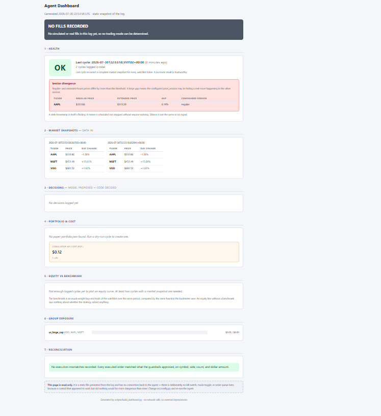

# Robinhood Agentic Trader

A guardrailed LLM trading agent built on the **Claude API's MCP connector** and
**Robinhood's Agentic Trading MCP server**. Claude reads live market data and
proposes trades in natural language; a separate layer of pure, unit-tested
Python independently re-derives every decision, enforces hard limits, and
requires human approval before anything reaches the broker.

> **Disclaimer:** This is a software engineering demonstration, not financial
> advice, and not a claim that the included strategy is profitable. The
> backtest below shows it underperforming a passive benchmark. It trades real
> money if you connect a funded account.

## The question this project is about

Connecting an LLM to a brokerage is a paste-one-URL affair. The interesting
engineering problem is what happens next: **how do you let a probabilistic
model take consequential, real-money actions without trusting it to police its
own limits?**

The answer implemented here is *the model proposes, deterministic code
disposes* — and, deliberately, the code does not trust the model's reasoning,
its arithmetic, or its report of what it did.

## Status

- ✅ 183 unit tests (`pytest tests/ -v`) — 182 passing, one POSIX-only file
  permission check skipped on Windows. No credentials required to verify.
- ✅ Backtested against ~2 years of real daily bars. Results below.
- ✅ Agent orchestration, MCP wiring, batch validation, instrument-type
  enforcement, post-execution reconciliation, CLI approval flow.
- ✅ **Ran against the funded live account for the first time on 2026-07-30.**
  OAuth login succeeded end-to-end; real quotes were fetched via MCP for
  every watchlist ticker; zero orders were proposed, correctly — nothing met
  the dip trigger that day. No order has ever been placed: every live call so
  far has been either auth-only (login) or read-only (`--dry-run` proposal
  cycles). See Known Limitations #11–13 for exactly what today's run verified
  versus what's still untested.

## Backtest results

This backtest was run under the previous configuration ($400 starting cash,
$25 orders, $150 per-position cap, $200 group cap). `src/config.py` now ships
smaller defaults sized for a $10 funded live account; the figures below are
historical and accurate as reported for the configuration they were run under.

Period: 2024-07-29 → 2026-07-27. Starting cash $400. Slippage 0.05% per side.
Signals computed on each bar's close, filled at the **next** bar's open — never
same-bar, to avoid lookahead.

| | Return | Max drawdown | Return / drawdown |
|---|---|---|---|
| **Strategy** | **+8.06%** | **2.60%** | **3.10** |
| Equal-weight buy & hold (VOO/AAPL/MSFT) | +28.92% | 23.83% | 1.21 |
| VOO buy & hold | +38.67% | 18.69% | 2.07 |

66 round trips · 72.7% win rate · both benchmarks beat the strategy on raw
return.

### Reading these numbers honestly

**The strategy lost on return and won on drawdown — but the drawdown win is
mostly low exposure, not risk management.** With $25 orders and a $200 group
cap against $400 of cash, the portfolio sat roughly 86% in cash. Being out of
the market is why the drawdown is shallow.

The fair test is a drawdown-matched passive comparison. A static 13.9% VOO /
86.1% cash portfolio has the same 2.60% max drawdown and returns 5.38% — which
the strategy's 8.06% beats. **However, this backtest credits no interest on
idle cash.** Over 2024–2026, short-term Treasuries and money market funds paid
roughly 4% annually. Crediting the cash leg at that rate brings the passive
drawdown-matched mix to roughly 12–13%, which **beats the strategy**.

Conclusion: at this account size and configuration, the strategy did not add
value over a passive mix at equivalent risk once cash yield is accounted for.

### Cost per trade, and why it may be the most useful result here

+8.06% on $400 is **$32.24 of profit across 66 round trips — about 49 cents per
round trip**, over two years.

Each daily cycle costs at least one Claude API call, plus additional calls on
days that trade (execution, then reconciliation). Across ~500 trading days,
[estimated, not yet measured] inference costs are plausibly in the same order
of magnitude as the returns. **At small account sizes, an LLM-driven trading
agent can cost roughly as much to operate as it earns.**

**First real measurement (2026-07-30):** two live proposal-only cycles (no
order qualified either time, so no execution/reconciliation calls) cost
$0.0549 and $0.0616 — about 5.5–6.2 cents each. Two data points, not an
average, and execution/reconciliation cost on a trade day remains
unmeasured. But at ~6 cents/day, ~500 trading days of proposal calls alone
would run roughly $27–31 — squarely in the same order of magnitude as the
backtest's entire $32.24 two-year profit, confirming the concern above
wasn't theoretical.

### On the 72.7% win rate

Win rate is a vanity metric and this project is a good demonstration of why. A
72.7% win rate that produces 49 cents per trade tells you almost nothing
without average win size, average loss size, and cost per trade. Promotional
material for AI trading systems leads with figures like this precisely because
they sound impressive in isolation.

## Architecture

Full data flow and design rationale: [`docs/ARCHITECTURE.md`](docs/ARCHITECTURE.md).

```
Claude (reads live quotes/positions via MCP) -> proposes trades + raw inputs
     |
validate_batch()  - pure, cumulative, unit-tested; re-derives every decision
     |
human approval (CLI, per order)
     |
Claude executes via MCP
     |
reconcile_order() - compares broker's actual orders to what was approved
     |
trade_log.jsonl   - append-only audit trail
```

### Safety design

- **Hard limits live in code, not the prompt.** `src/guardrails.py` has zero
  network or model dependencies — pure functions checking floats against fixed
  thresholds.
- **The model's reasoning is re-derived, not trusted.** Proposals must include
  the raw numbers behind them; guardrails recompute the decision independently.
- **Batch validation, not per-order.** `validate_batch()` evaluates a day's
  orders cumulatively against a running position snapshot. Validating orders
  independently allowed a market-wide dip to clear the group cap by up to
  `(group_size - 1) * order_dollars` — the exact scenario the cap exists to
  prevent.
- **Correlation groups, declared not computed.** VOO *contains* AAPL and MSFT,
  so they are capped as one bet. Structural grouping is used rather than
  rolling correlation because measured correlations converge toward 1 during
  crashes — loosening precisely when the constraint should tighten.
- **Exit rules that can fire on losers.** An earlier version could only sell
  above cost basis, so a declining position was held indefinitely. Exits now
  fire on profit target, a time limit (thesis invalidation), or a wide disaster
  stop. A tight stop-loss is deliberately *not* used: it contradicts a
  mean-reversion premise by selling exactly when the signal says hold.
- **Instrument-type enforcement.** Robinhood's agentic channel now supports
  long options orders. `validate_instrument()` rejects anything that isn't a
  plain equity symbol, including OCC-style option identifiers.
- **Post-execution reconciliation.** After execution, the actual orders on the
  account are fetched and compared to what was approved — symbol, side, count,
  and dollar amount within 1%.
- **Human-in-the-loop by default.** `approval_mode=True`; nothing executes
  without a per-order `YES`.
- **Scoped account.** Robinhood requires agent trades to route through a
  dedicated Agentic account, isolated from other holdings.

### Observability

- **Market snapshot logging.** Every cycle logs the raw quote fields for every
  watchlist ticker whether or not an order was proposed — the only way to tell
  "fetched real data, nothing qualified" apart from "the tool call failed."
  A missing or incomplete snapshot raises a loud warning rather than looking
  like a quiet, uneventful day.
- **Token cost logging.** Every API call logs real token counts and an estimated
  dollar cost, attributed by call type, so operating cost can be compared
  against realized P&L instead of assumed negligible.
- **`build_dashboard.py`.** A static, read-only HTML dashboard rendered
  from `trade_log.jsonl` — no server, no connection back to the agent.
  Full detail in [docs/ARCHITECTURE.md](docs/ARCHITECTURE.md).



This is a real cycle from 2026-07-30, not a mockup — the divergence panel
is the instrumentation catching a real after-hours move that the
configured session correctly ignored.

## Known limitations

Stated plainly because they're real, and because a reviewer will find them.

**Trust boundary**

1. **Guardrails re-derive decisions, not inputs.** The model supplies
   `day_change_pct`, `days_held`, and `positions`. A model that misreports an
   input gets a validated decision on false data. Narrowing this requires
   fetching market data independently of the model.
2. **Reconciliation is model-mediated.** The same model that executes is asked
   to report what it executed. This catches accidental failures — confused
   models, tool errors, duplicate fills — but is worth little against anything
   adversarial. A direct HTTP call to the MCP server from Python, with no model
   in the loop, would close it.
3. **Capacity/reconciliation seam.** `running_positions` updates on
   approve-and-execute, before reconciliation runs. If reconciliation flags a
   mismatch, capacity was already assumed spent. Fails conservative.
4. **No prompt-injection testing.** Market data and tool output are untrusted
   text reaching a model with a path to order placement. The guardrails bound
   the damage; there is no test suite proving it.

**Backtest**

5. **No interest credited on idle cash** — materially flatters the strategy
   relative to a passive mix, as discussed above.
6. **Ticker selection bias.** VOO/AAPL/MSFT were chosen in 2026 knowing they
   rose. This measures whether the *rules* beat holding those three names, not
   whether the strategy would have found them.
7. **One period, one regime, three correlated tickers.** Max drawdown from a
   single 2-year sample is a noisy statistic.
8. **Data source caveats.** `scripts/load_bars_local.py` uses `yfinance` (an
   unofficial Yahoo Finance wrapper) with `auto_adjust=True`, giving
   total-return series; `scripts/fetch_bars.py` requests Robinhood's split-only
   adjustment. The two are **not** interchangeable on dividend-paying tickers.
   Back-adjusted prices also embed a technical lookahead, immaterial at
   quarterly dividend scale against a 2% trigger.

**Operational**

9. **Time exits resolve at schedule granularity.** `max_hold_days = 10`
   evaluated on a weekly schedule means roughly 14 calendar days.
10. **The effective account cap is $200, not $400.** With every watchlist
    ticker in one correlation group and `max_group_dollars = 200`,
    `max_total_dollars = 400` can never bind.
11. **OAuth login and MCP tool calls are verified end-to-end; token refresh
    is not.** Robinhood's Agentic Trading MCP uses OAuth with short-lived
    tokens issued to a client, so a static bearer token pasted into `.env`
    as `ROBINHOOD_MCP_TOKEN` cannot authenticate — confirmed, not suspected.
    The fix, `src/oauth.py`, has now been run for real against Robinhood's
    live authorization server: `scripts/oauth_login.py` completed a real
    login, state verification, code exchange, and token storage
    successfully — and the resulting access token authenticated real MCP
    calls: `get_equity_quotes`, `get_accounts`, and `get_equity_positions`
    all worked against the live server, fetching real watchlist quotes and
    confirming the agentic account (`<agentic-account>`) had zero open positions.
    The `READ_ONLY_TOOLS` allowlist in `agent.py` is verified;
    `EXECUTION_TOOLS`/`RECONCILE_TOOLS` are not, since no order has ever
    qualified for approval. What's still unverified: token **refresh** has
    not been exercised (it requires an actually-expired access token, which
    no login so far has produced), and refresh-token rotation handling
    (`_refresh_tokens()`'s fallback for a server that omits a new
    `refresh_token`) is untested against the real endpoint — both are only
    covered by mocked-HTTP tests in `tests/test_oauth.py`. Staying in Known
    Limitations until refresh is exercised for real and an order is actually
    placed and reconciled.
12. **The MCP beta header was wrong for an unknown period, caught only by a
    real API call.** `MCP_BETA_HEADER` was set to `mcp-client-2025-11-25`,
    which the Anthropic API rejects outright with a 400. All 139 tests passed
    anyway, because every test uses a fake client that never sends a real
    header — the bug was invisible to the entire suite. Fixed to the
    documented `mcp-client-2025-11-20`. A note on the limits of mocked
    testing: a wrong constant that's never exercised against the real API can
    sit behind full test coverage indefinitely.
13. **A false negative found on the first live cycle: the model silently
    picked regular-session price, missing an 8% after-hours move.** AAPL's
    regular-session close was roughly flat, but a later after-hours trade
    was down ~8% — a real dip that would have qualified for a buy under the
    extended session, not the regular one. The model's `day_change_pct` was
    arithmetically correct for the price field it picked; it simply picked
    which session to trade on, silently, on its own, each run. Fixed by
    making `price_session` an explicit `AgentConfig` value (`"regular"` by
    default), recomputing `day_change_pct` in code from the raw
    `last_trade_price` / `last_non_reg_trade_price` / `adjusted_previous_close`
    fields rather than trusting the model's arithmetic, and logging
    `session_divergence` whenever the two sessions disagree by more than 1%
    — confirmed working on a subsequent live cycle the same day, where it
    correctly fired for AAPL's ~6.2% regular/extended price gap. Read this
    precisely: the default (`"regular"`) still ignores
    after-hours moves **by design** — a dip that only shows up after hours
    will not trigger a buy unless `price_session="extended"`. What changed
    is that this choice is now explicit, deterministic, and logged every
    time it matters, instead of being made silently by the model on a
    per-run basis.

## Setup

```bash
git clone https://github.com/EUGMsub/RobinhoodAgenticTrader.git
cd RobinhoodAgenticTrader
pip install -r requirements.txt
pytest tests/ -v          # 183 tests (182 pass, 1 skipped on Windows), no credentials needed
```

Reproduce the backtest (no credentials, no funded account):

```bash
python scripts/load_bars_local.py
python scripts/run_backtest.py
```

Run the live agent (requires credentials — see `.env.example`):

```bash
cp .env.example .env      # fill in ANTHROPIC_API_KEY, ROBINHOOD_MCP_URL,
                          # ROBINHOOD_ACCOUNT_NUMBER, ROBINHOOD_CLIENT_ID
python scripts/oauth_login.py   # one-time OAuth login (see Known Limitations #11)
python scripts/run_agent.py
```

Access to Robinhood Agentic Trading and a dedicated Agentic account are
required for live use; setup is at
[robinhood.com/us/en/support/agentic-trading](https://robinhood.com/us/en/support/agentic-trading).

## Project structure

```
src/
  config.py         typed configuration - every constraint in one object
  strategy.py       the natural-language strategy prompt
  guardrails.py     pure, unit-tested hard limits + batch validation
  reconcile.py      pure post-execution order verification
  agent.py          orchestration: MCP calls, validation, approval, execution
  oauth.py          OAuth 2.1 authorization-code + PKCE client for the MCP server
  backtest.py       pure replay engine - reuses guardrails unchanged
  logging_utils.py  append-only structured audit log
tests/              183 tests (182 pass, 1 skipped on Windows), zero network calls
scripts/
  run_agent.py        live agent entry point
  oauth_login.py      one-time interactive OAuth login
  load_bars_local.py  credential-free bar loader (yfinance)
  fetch_bars.py       bar loader via Robinhood MCP
  run_backtest.py     backtest runner + benchmark report
docs/ARCHITECTURE.md
```

## License

MIT — see [LICENSE](LICENSE).
